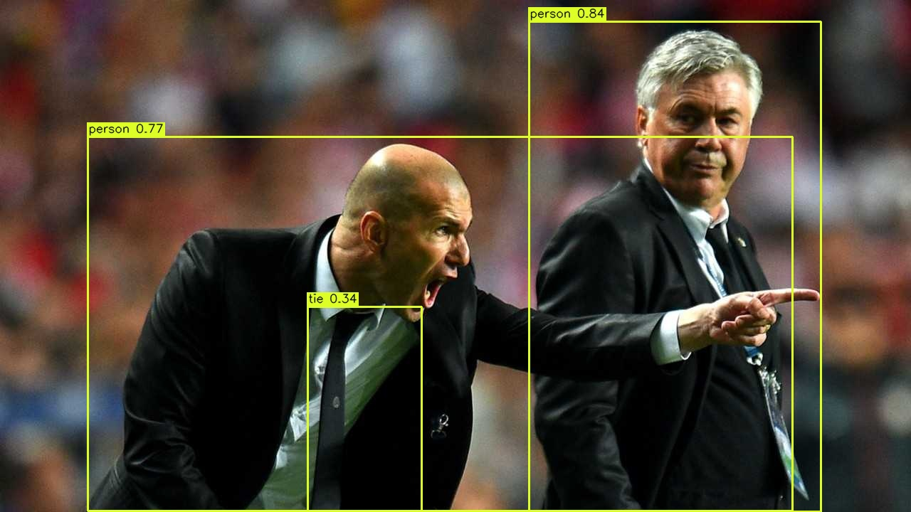

# YOLOv11 Object Detection

基于OpenCV DNN的YOLOv11目标检测项目，支持ONNX模型推理。

## 项目特性

- ✅ 支持YOLOv11 ONNX模型推理
- ✅ 置信度阈值和NMS阈值可配置
- ✅ 动态模型切换支持
- ✅ 分步处理模式
- ✅ 结果可视化
- ✅ C++17标准

## 项目结构

```
YOLOv11_OpenCV_DNN/
├── CMakeLists.txt          # CMake配置文件
├── main.cpp                # 主程序入口
├── YOLOv11.h              # YOLOv11类头文件
├── YOLOv11.cpp            # YOLOv11类实现
├── yolo11n.onnx           # YOLOv11 Nano模型文件
├── test_image.jpg         # 测试图片
└── README.md              # 项目说明文档
```

## 依赖项

- OpenCV 4.x (包含DNN模块)
- CMake 3.10+
- C++17编译器
- ONNX模型文件

## 编译安装

### 1. 克隆项目
```bash
git clone https://github.com/xiangxiwf/YOLOv11_OpenCV_DNN.git
cd YOLOv11_OpenCV_DNN
```

### 2. 创建构建目录
```bash
mkdir build
cd build
```

### 3. 配置CMake
```bash
cmake ..
```

### 4. 编译
```bash
make
```

## 使用方法

### 基本用法
```bash
# 运行检测程序
./YOLOv11_detector
```

### 代码使用示例

#### 方法一：分步处理（推荐）
```cpp
#include "YOLOv11.h"

// 初始化检测器
YOLOv11 detector("");
detector.setModel("path/to/model.onnx");
detector.setConf(0.25f);  // 设置置信度阈值
detector.setNMS(0.35f);   // 设置NMS阈值

// 加载图片
cv::Mat image = cv::imread("test.jpg");

// 分步处理
detector.preprocessImage(image);    // 预处理
detector.runInference();            // 运行推理
detector.postprocessResults();      // 后处理
std::vector<Detection> detections = detector.getDetections();

// 绘制结果
detector.drawBoundingBoxes(image);
```

#### 方法二：一键式检测
```cpp
// 一次性完成所有处理步骤
std::vector<Detection> detections = detector.detect(image);
```

## API 接口

### 类构造函数
```cpp
YOLOv11(const std::string& model_path);
```
- `model_path`: ONNX模型文件路径，可以为空字符串

### 配置接口
```cpp
void setConf(float conf);                    // 设置置信度阈值 (0.0-1.0)
void setNMS(float nms);                      // 设置NMS阈值 (0.0-1.0)
void setModel(const std::string& model_path); // 设置/更换模型
```

### 核心处理接口
```cpp
void preprocessImage(const cv::Mat& image);  // 图像预处理
void runInference();                         // 运行推理
void postprocessResults();                   // 后处理结果
std::vector<Detection> detect(const cv::Mat& image); // 一键检测
```

### 辅助接口
```cpp
std::vector<Detection> getDetections() const;  // 获取检测结果
void drawBoundingBoxes(cv::Mat& image);       // 绘制边界框
```

### Detection结构体
```cpp
struct Detection {
    float confidence;           // 置信度
    int class_id;              // 类别ID
    cv::Rect box;              // 边界框
    std::string class_name;    // 类别名称
};
```

## 模型支持

项目支持标准的YOLOv11 ONNX模型：
- YOLOv11n (Nano) - 最小最快
- YOLOv11s (Small)
- YOLOv11m (Medium)
- YOLOv11l (Large)
- YOLOv11x (Extra Large)

## 性能优化

### GPU加速
如果需要GPU加速，可以修改推理后端：
```cpp
net.setPreferableBackend(cv::dnn::DNN_BACKEND_CUDA);
net.setPreferableTarget(cv::dnn::DNN_TARGET_CUDA);
```

### 输入尺寸调整
默认输入尺寸为640x640，可在代码中修改：
```cpp
cv::Size input_size = cv::Size(640, 640);  // 在YOLOv11.h中修改
```

## 输出结果

程序会：
1. 显示检测结果的窗口
2. 保存检测结果图片到 `build/detection_result.jpg`
3. 在控制台输出检测性能信息

### 检测结果示例

以下是程序生成的检测结果示例：



*图：YOLOv11目标检测结果示例，显示了检测到的物体边界框和类别标签*

### 结果说明

- **边界框**：彩色矩形框标识检测到的物体
- **类别标签**：显示物体类别和置信度分数
- **配色方案**：高对比度配色确保在各种背景下清晰可见

## 故障排除

### 常见错误

1. **OpenCV版本问题**
   ```
   解决方案：确保OpenCV版本 >= 4.0，并包含DNN模块
   ```

2. **模型加载失败**
   ```
   错误：Can't read ONNX file
   解决方案：检查模型文件路径是否正确，文件是否损坏
   ```

3. **图片加载失败**
   ```
   错误：Failed to load image
   解决方案：检查图片路径是否正确，格式是否支持
   ```

4. **编译错误**
   ```
   解决方案：确保C++17编译器和CMake版本正确
   ```

## 更新日志

- **v1.0.0** - 初始版本，支持YOLOv11检测

欢迎提交Issue和Pull Request来改进这个项目。

## 许可证

MIT License

## 联系方式

如有问题或建议，请通过Issue联系。
